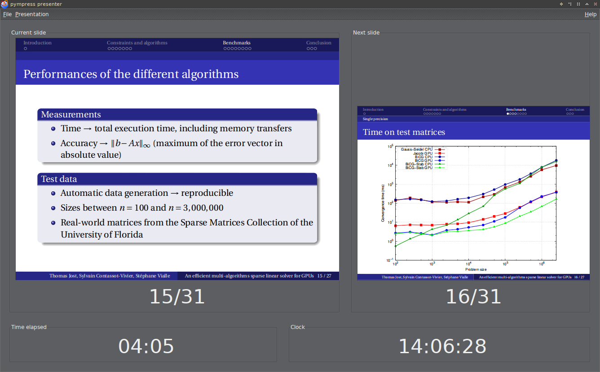
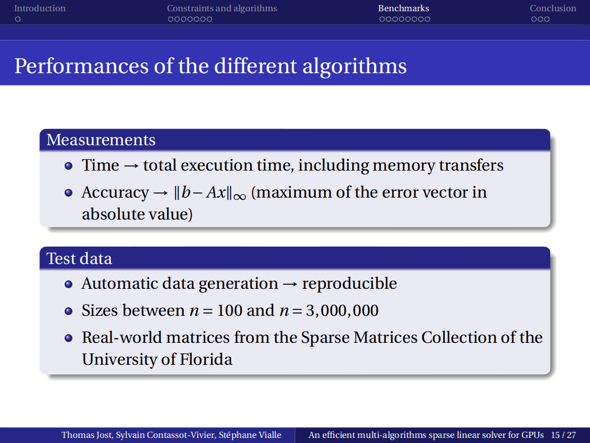

Welcome to pympress!
====================

pympress is a little PDF reader written in Python using Poppler for PDF
rendering and GTK for the GUI.

The special thing is that it is designed to be a dual-screen PDF reader used
during presentations and public talks. If you need to make a presentation using
your laptop and an overhead projector, you may well like it. You will have your
presentation fullscreen on the projector, and at the same time some useful data
on your laptop screen: a view of the current slide, a thumbnail of the next one,
a clock, and a time counter indicating for how long you have been talking.

pympress is a free software, distributed under the terms of the GPL license
(version 2 or, at your option, any later version).

Screenshots
-----------

Here is the Presenter window, i.e. the one that *you* will be seeing during your
presentation:

Meanwhile, your audience will only see the current slide as displayed by the
Content window:

Where can I find it?
--------------------

pympress source code is hosted on `GitHub`_. The stable releases can be found on
the :doc:`download page <download>`. You can browse the code using the `web
interface`_, or you can download it using git: ``git clone
git://github.com/Schnouki/pympress.git``

.. _GitHub: https://github.com/
.. _web interface: https://github.com/Schnouki/pympress

Contributing
------------

pympress is still very young, and there are lots of things that need
improvement. If you notice a bug, or if you have an idea for a new feature or
any other enhancement, please fill a bug on the `issue tracker`_.

pympress is free software, and you are welcome to :doc:`hack <hacking>` it if
you like it. If you want to contribute with some code, feel free to :doc:`send
me a patch <contact>` or to ask me to pull from a Git repository, I'll be glad
to do it.

.. _issue tracker: https://github.com/Schnouki/pympress/issues

Table of contents
-----------------

.. toctree::
   :maxdepth: 2

   news
   download
   user_guide
   hacking
   contact
